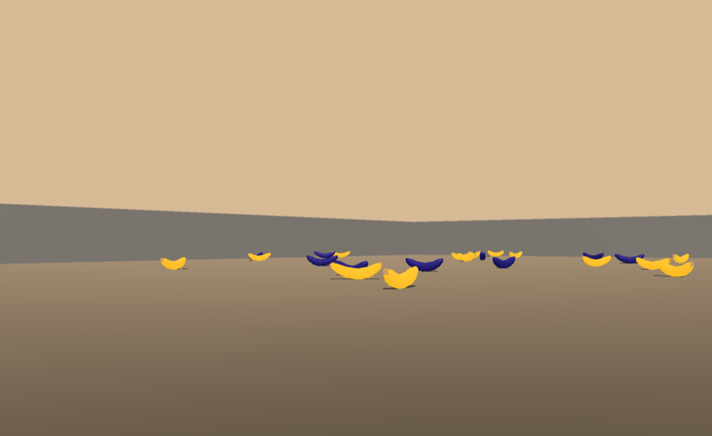

[image2]: https://user-images.githubusercontent.com/10624937/42135623-e770e354-7d12-11e8-998d-29fc74429ca2.gif "Trained Agent"
[image3]: https://user-images.githubusercontent.com/10624937/43851024-320ba930-9aff-11e8-8493-ee547c6af349.gif "Trained Agent"

# Deep Reinforcement Learning

This repository contains solutions to Deep Reinforcement Learning Problems. Different types of agents are utilitzed according to the properties of the problems.

Detailed Readmes can be found in each project folder.
 
### Table of contents
* [Environments](#Environments)
    * [Banana Environment](#goal-reward)
    * [Continous Reacher Environment](#continous-reacher-environment)
    * [Multi-Agent continous Tennis Environment](#multi-agent-continous-tennis-environment)

* [Agent](#agent)
    * [Deep Q-Learning Agent (DQN)](#deep-q-learning-agent)
    * [Deep Deterministic Policy Gradient (DDPG)](#deep-deterministic-policy-gradient)
    * [Multi-Agent Deep Deterministic Policy Gradient (DDPG)](#multi-agent-deep-deterministic-policy-gradient)
* [References](#references)

 

# Environments
---
There are three environments that agents were developed on. Each increase in level of difficulty, from discrete action space, to continous actions and finally to multi-agent problems.

### Banana Environment
In this challenge a single agent has to collect yellow bananas, while avoiding purple ones.
[More information in this folder](https://github.com/szemyd/deep-reinforcement-learning/tree/main/DQN%20Agent%20-%20Navigation%20Environment) 
  

 

### Continous Reacher Environment
In this challenge a single agent has to maintain it's end effector on a moving target. Each step that the end effector spends in the target location results in positive rewards.

[More information in this folder](https://github.com/szemyd/deep-reinforcement-learning/tree/main/DDPG%20Agent%20-%20Continous%20Reacher%20Environment) 

 

![Trained Agent][image3]

 

### Multi-Agent continous Tennis Environment

In this environment two agents play tennis. Each agent receives positive rewards for hitting the ball over the net, and a smaller negative reward if the ball falls on their side.

[More information in this folder](https://github.com/szemyd/deep-reinforcement-learning/tree/main/DDPG%20Agent%20-%20Continous%20Multi-Agent%20Environment) 
 
![Trained Agent][image2]

# Agents
---

### Deep Q-Learning Agent

This repo contains implementation of two DQN Agents in __PyTorch__:
-  a __base Agent__, with a Replay Buffer, a seperate target Q-Network, with a 2 hidden layer deep network
- an Agent built on top of the base Agent, which utilizes __Prioritized Replay__.

 
 

### Deep Deterministic Policy Gradient
This repo contains implementation of a DDPG Agent in __PyTorch__.

The DDPG architecture is considered by many to be an Actor-Critic method. In the learning step the agent selects a next step to calculate the Temporal Difference (which isbiased in regards of the actual value) with a Policy network (which has large variance in regards of the actual value). This way both bias and variance is decreased.

The DDPG agent was able to solve the environment under 250episodes. 
 
 

### Multi-Agent Deep Deterministic Policy Gradient
The DDPG Agent has been extended to support multi-agent environments.

The DDPG agent was able to solve the environment under 2000episodesand reached amaximumoverallscoreaveragedover 100 episodeof +2.05 by episode 2655. To speed up the hyperparameter tuning phase, an abstract training loop was utilized,that could calculate permutations of hyperparameters during evening hours when electricity cost are lower.

 

# References
---

Environment and Agents were both based on starter codes from the Udacity Deep Reinforcement Learning Nanodegree. [Github repo can be found here](https://github.com/udacity/deep-reinforcement-learning).

Special thanks to Miguel Morales (@mimoralea), for writing such a comprehensive book on Deep Reinforcement Learning. I have taken many  clarifications on theory and practice when developing the agents, [his book can be found here](https://www.manning.com/books/grokking-deep-reinforcement-learning).